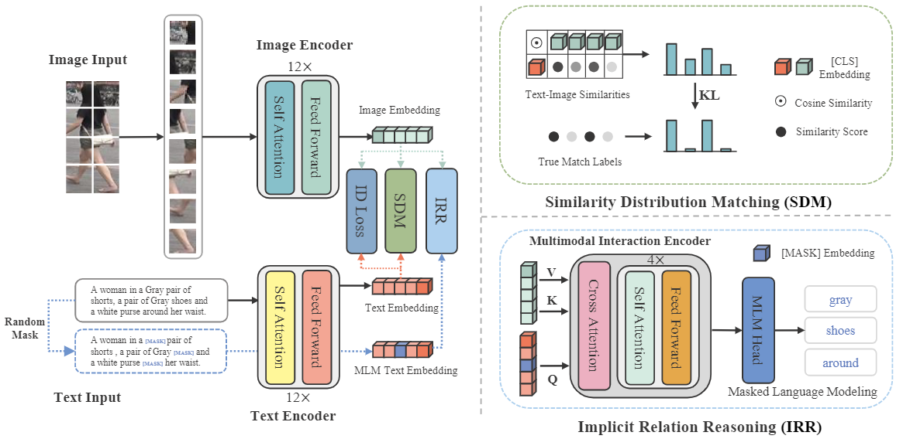

# Cross-Modal Implicit Relation Reasoning and Aligning for Text-to-Image Person Retrieval
[](https://github.com/anosorae/IRRA/blob/main/LICENSE) [](https://paperswithcode.com/sota/nlp-based-person-retrival-on-cuhk-pedes?p=cross-modal-implicit-relation-reasoning-and)

Official PyTorch implementation of the paper Cross-Modal Implicit Relation Reasoning and Aligning for Text-to-Image Person Retrieval. (CVPR 2023) [arXiv](https://arxiv.org/abs/2303.12501)

## Updates
- (3/23/2023) Add arXiv link for our paper.
- (3/18/2023) Add download links of trained models and logs.
- (3/17/2023) Ensure the reproducibility of our code.
- (3/13/2023) Code released!

## Highlights

The goal of this work is to enhance global text-to-image person retrieval performance, without requiring any additional supervision and inference cost. To achieve this, we utilize the full CLIP model as our feature extraction backbone. Additionally, we propose a novel cross-modal matching loss (SDM) and an Implicit Relation Reasoning module to mine fine-grained image-text relationships, enabling IRRA to learn more discriminative global image-text representations.




## Usage
### Requirements
we use single RTX3090 24G GPU for training and evaluation. 
```
pytorch 1.9.0
torchvision 0.10.0
prettytable
easydict
```

### Prepare Datasets
Download the CUHK-PEDES dataset from [here](https://github.com/ShuangLI59/Person-Search-with-Natural-Language-Description), ICFG-PEDES dataset from [here](https://github.com/zifyloo/SSAN) and RSTPReid dataset form [here](https://github.com/NjtechCVLab/RSTPReid-Dataset)
TAG-PEDES follows the official TAG-PR release at https://github.com/Flame-Chasers/TAG-PR and is supported through its `train_reid.json` / `test_reid.json` schema.

Organize them in `your dataset root dir` folder as follows:
```
|-- your dataset root dir/
|   |-- <CUHK-PEDES>/
|       |-- imgs
|            |-- cam_a
|            |-- cam_b
|            |-- ...
|       |-- reid_raw.json
|
|   |-- <ICFG-PEDES>/
|       |-- imgs
|            |-- test
|            |-- train 
|       |-- ICFG_PEDES.json
|
|   |-- <RSTPReid>/
|       |-- imgs
|       |-- data_captions.json
|-- TAG-PEDES/
|   |-- train_reid.json
|   |-- test_reid.json
|   |-- G2APS/
|   |-- AG-ReID.v2/
|
|-- TAG-PEDES/
|   |-- anno_dir/
|   |   |-- train_reid.json
|   |   |-- test_reid.json
|   |-- images/
```


## Training

```python
python train.py \
--name iira \
--img_aug \
--batch_size 64 \
--MLM \
--loss_names 'sdm+mlm+id' \
--dataset_name 'CUHK-PEDES' \
--root_dir 'your dataset root dir' \
--num_epoch 60
```

## Testing

```python
python test.py --config_file 'path/to/model_dir/configs.yaml'
```

## SuperCLIP Checkpoint Compatibility Experiment

This repository includes a minimal SuperCLIP compatibility path for backbone-initialization diagnosis only. It does not add SuperCLIP classification heads, does not change IRRA-light losses, and does not change TAG-PEDES/CUHK-PEDES dataloaders or training hyperparameters.

Inspect an original SuperCLIP checkpoint:

```bash
python tools/inspect_superclip_ckpt.py \
  --ckpt /path/to/original_superclip_checkpoint.pt
```

Convert encoder weights that match the current ViT-B/16 CLIP backbone:

```bash
python tools/convert_superclip_to_irra_clip.py \
  --superclip_ckpt /path/to/original_superclip_checkpoint.pt \
  --output /root/autodl-tmp/IRRA_light_baseline/pretrained/superclip_irra_vitb16.pt \
  --pretrain_choice ViT-B/16 \
  --img_size 384 128 \
  --stride_size 16
```

Run the TAG-PEDES `single_pure` initialization control on the 4090 workspace:

```bash
PRETRAIN_CHOICE=/root/autodl-tmp/IRRA_light_baseline/pretrained/superclip_irra_vitb16.pt \
bash run_irra_light_4090_tag_single_pure_superclip.sh
```

The first formal control should only record OpenAI CLIP ViT-B/16 `single_pure` versus SuperCLIP-initialized ViT-B/16 `single_pure`. Reuse in `single_proj_pure` or `split_pure` should be considered only after the `single_pure` initialization control is useful.

## v16 Scheme-1 Support-Bag Diagnostic

The repository also includes the first v16 diagnostic route as two explicit IRRA-light modes:

- `single_proj_bag`: single projection head with original-pair identity alignment plus same-PID different-image support-bag positives.
- `split_bag`: identity head receives original-pair and support-bag identity losses; state head remains restricted to original paired image-text alignment.

This is not the full v16 evidence-routing method. It does not add same-image caption reliability weighting, phrase-level tri-state MLLM labels, or similar-identity negative-bag training.

```bash
IRRA_LIGHT_MODE=single_proj_bag bash run_irra_light_4090_tag_v16_scheme1_bag.sh
IRRA_LIGHT_MODE=split_bag bash run_irra_light_4090_tag_v16_scheme1_bag.sh
```

## v16 Three Fast Versions

The v16 fast3 route adds three split-head TAG-PEDES modes without changing any
existing IRRA-light mode:

- `split_bag_safe`: keeps the split-pure identity SDM and paired state ITC
  losses, then adds a one-way text-to-same-PID-support-image identity ranking
  loss.
- `split_bag_state`: adds a state non-transitive loss only for support images
  with an explicit local hard contradiction.
- `split_bag_state_hn`: adds one persistent similar-but-different-PID image to
  the identity negative aggregation. It is never used by the state loss.

The fast3 modes only encode support images through a frozen CLIP backbone. They
do not encode support captions, do not replace the baseline split-pure losses,
and do not enter the legacy support-bag branch.

Prepare the three required inputs from frozen diagnostics. This command only
converts and validates existing tables; it does not mine model features.

```bash
python tools/v16/prepare_fast3_inputs.py \
  --dataset-root /root/autodl-tmp/datasets \
  --consistency-csv /path/to/intra_image_caption_consistency.csv \
  --support-conflict-csv /path/to/support_conflict_pairs.csv \
  --similar-pid-csv /path/to/persistent_similar_pid_candidates.csv \
  --output-dir diagnostics/TAG-PEDES/v16_fast3_inputs
```

If the frozen diagnostics contain the native
`relation_pairs_with_hard.csv` rather than an already aggregated candidate
table, provide it as `--similar-pid-csv` together with the matching frozen
`relation_score_table.csv`. The preparation script then derives persistent
training candidates from the existing E-relation rows and scores only; it does
not run a model.

```bash
python tools/v16/prepare_fast3_inputs.py \
  --dataset-root /root/autodl-tmp/datasets \
  --consistency-csv /path/to/intra_image_caption_consistency.csv \
  --support-conflict-csv /path/to/support_conflict_pairs.csv \
  --similar-pid-csv /path/to/relation_pairs_with_hard.csv \
  --similar-score-csv /path/to/relation_score_table.csv \
  --output-dir diagnostics/TAG-PEDES/v16_fast3_inputs
```

Run the static/dynamic audit after input preparation:

```bash
python tools/v16/audit_fast3.py \
  --dataset-root /root/autodl-tmp/datasets \
  --consistency-csv diagnostics/TAG-PEDES/v16_fast3_inputs/support_reliability_hard_only.csv \
  --support-relation-csv diagnostics/TAG-PEDES/v16_fast3_inputs/support_hard_contradiction.csv \
  --hard-negative-csv diagnostics/TAG-PEDES/v16_fast3_inputs/hard_negative_pool.csv \
  --output-dir diagnostics/TAG-PEDES/v16_fast3_audit
```

For a one-epoch smoke run, override the epoch count explicitly:

```bash
NUM_EPOCH=1 IRRA_LIGHT_MODE=split_bag_safe bash run_irra_light_4090_tag_v16_fast3.sh
NUM_EPOCH=1 IRRA_LIGHT_MODE=split_bag_state bash run_irra_light_4090_tag_v16_fast3.sh
NUM_EPOCH=1 IRRA_LIGHT_MODE=split_bag_state_hn bash run_irra_light_4090_tag_v16_fast3.sh
```

The full serial launcher fixes all three runs at 60 epochs. Before each run it
creates a separate immutable Git code snapshot plus copied input tables, so a
later version cannot overwrite the code or inputs recorded for an earlier one.

```bash
nohup bash run_v16_fast3_all.sh > v16_fast3_all.nohup 2>&1 &
```

After a `split_bag_state` or `split_bag_state_hn` run, evaluate the two heads
without retraining or fusion-ratio search:

```bash
python tools/v16/eval_fast3_dual_heads.py \
  --config-file /path/to/configs.yaml \
  --ckpt-file /path/to/best.pth \
  --output-dir /path/to/fast3_dual_head_eval
```

## IRRA on Text-to-Image Person Retrieval Results
#### CUHK-PEDES dataset

|     Method      |     Backbone     |  Rank-1   |  Rank-5   |  Rank-10  |    mAP    |   mINP    |
| :-------------: | :--------------: | :-------: | :-------: | :-------: | :-------: | :-------: |
|     CMPM/C      |    RN50/LSTM     |   49.37   |     -     |   79.27   |     -     |     -     |
|      DSSL       |    RN50/BERT     |   59.98   |   80.41   |   87.56   |     -     |     -     |
|      SSAN       |    RN50/LSTM     |   61.37   |   80.15   |   86.73   |     -     |     -     |
|   Han et al.    |  RN101/Xformer   |   64.08   |   81.73   |   88.19   |   60.08   |     -     |
|      LGUR       | DeiT-Small/BERT  |   65.25   |   83.12   |   89.00   |     -     |     -     |
|       IVT       |  ViT-B-16/BERT   |   65.59   |   83.11   |   89.21   |     -     |     -     |
|      CFine      |  ViT-B-16/BERT   |   69.57   |   85.93   |   91.15   |     -     |     -     |
|    **CLIP**     | ViT-B-16/Xformer |   68.19   |   86.47   |   91.47   |   61.12   |   44.86   |
| **IRRA (ours)** | ViT-B-16/Xformer | **73.38** | **89.93** | **93.71** | **66.13** | **50.24** |

[Model & log for CUHK-PEDES](https://drive.google.com/file/d/1OBhFhpZpltRMZ88K6ceNUv4vZgevsFCW/view?usp=share_link)

#### ICFG-PEDES dataset

|     Method      |  Rank-1   |  Rank-5   |  Rank-10  |    mAP    |   mINP   |
| :-------------: | :-------: | :-------: | :-------: | :-------: | :------: |
|     CMPM/C      |   43.51   |   65.44   |   74.26   |     -     |    -     |
|      SSAN       |   54.23   |   72.63   |   79.53   |     -     |    -     |
|       IVT       |   56.04   |   73.60   |   80.22   |     -     |    -     |
|      CFine      |   60.83   |   76.55   |   82.42   |     -     |    -     |
|    **CLIP**     |   56.74   |   75.72   |   82.26   |   31.84   |   5.03   |
| **IRRA (ours)** | **63.46** | **80.24** | **85.82** | **38.05** | **7.92** |

[Model & log for ICFG-PEDES](https://drive.google.com/file/d/1Y3D7zZsKPpuEHWJ9nVecUW-HaKdjDI9g/view?usp=share_link)

#### RSTPReid dataset

|     Method      |  Rank-1   |  Rank-5   |  Rank-10  |    mAP    |   mINP    |
| :-------------: | :-------: | :-------: | :-------: | :-------: | :-------: |
|      DSSL       |   39.05   |   62.60   |   73.95   |     -     |     -     |
|      SSAN       |   43.50   |   67.80   |   77.15   |     -     |     -     |
|       IVT       |   46.70   |   70.00   |   78.80   |     -     |     -     |
|      CFine      |   50.55   |   72.50   |   81.60   |     -     |     -     |
|    **CLIP**     |   54.05   |   80.70   |   88.00   |   43.41   |   22.31   |
| **IRRA (ours)** | **60.20** | **81.30** | **88.20** | **47.17** | **25.28** |

[HIRE-v2 v16.1.0, v16.2.1, and v16.4.0 RSTPReid transfer records](experiment_logs/4090/RSTPReid/20260719_HIRE_v2_RSTPReid_v16_trio_e6b3159/RESULTS.md)

[Model & log for RSTPReid](https://drive.google.com/file/d/1LpUHkLErEWkJiXyWYxWwiK-8Fz1_1QGY/view?usp=share_link)


## Acknowledgments
Some components of this code implementation are adopted from [CLIP](https://github.com/openai/CLIP), [TextReID](https://github.com/BrandonHanx/TextReID) and [TransReID](https://github.com/damo-cv/TransReID). We sincerely appreciate for their contributions.


## Citation
If you find this code useful for your research, please cite our paper.

```tex
@inproceedings{cvpr23crossmodal,
  title={Cross-Modal Implicit Relation Reasoning and Aligning for Text-to-Image Person Retrieval},
  author={Jiang, Ding and Ye, Mang},
  booktitle={IEEE International Conference on Computer Vision and Pattern Recognition (CVPR)},
  year={2023},
}
```

## Contact
If you have any question, please feel free to contact us. E-mail: [jiangding@whu.edu.cn](mailto:jiangding@whu.edu.cn), [yemang@whu.edu.cn](mailto:yemang@whu.edu.cn).
